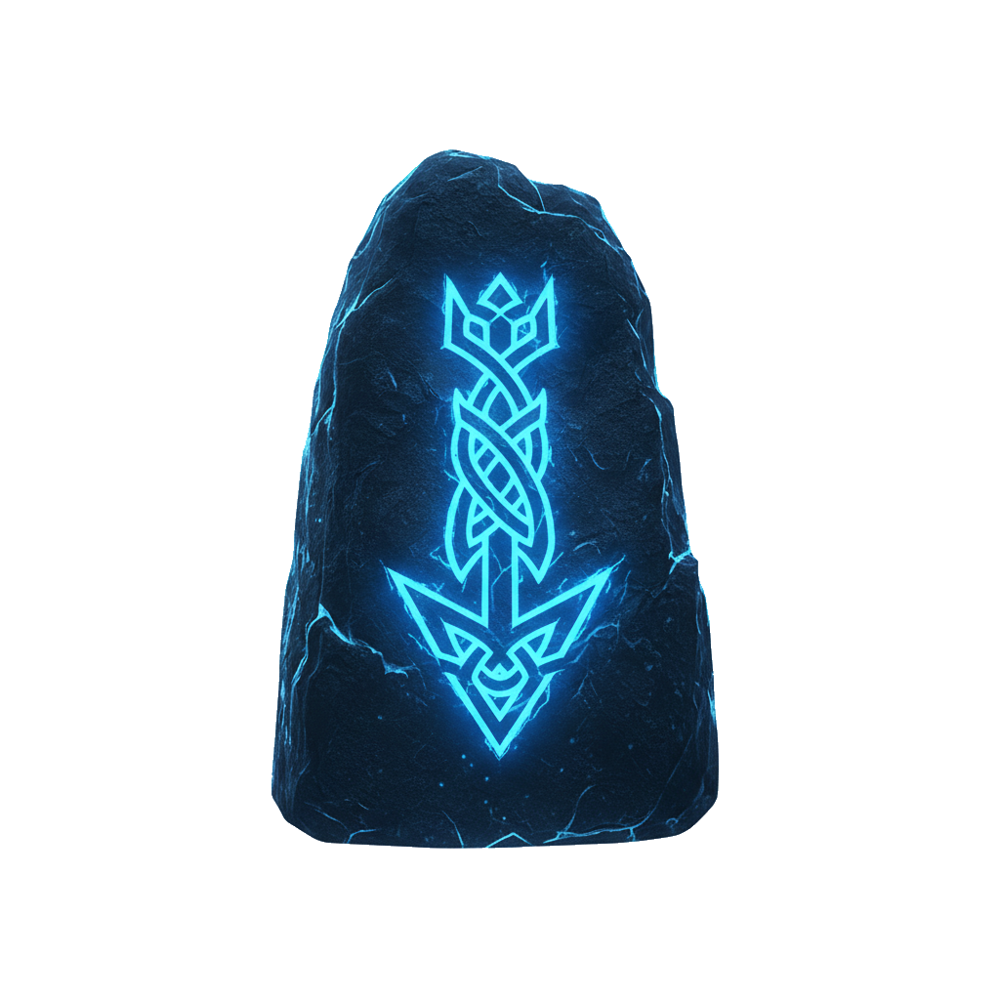

# ⚡ Rune Scroller

<div align="center">
	
</div>

**Native Scroll Animations for Svelte 5** — Built with **Svelte 5 Runes** and **IntersectionObserver API**. No external dependencies, pure performance.

> 🚀 **Open Source Project** by **[ludoloops](https://github.com/ludoloops)** at **[LeLab.dev](https://lelab.dev)**
> 📜 Licensed under **MIT** — Contributions welcome!
>
> A modern, lightweight scroll animation library showcasing Svelte 5 capabilities

---

## ✨ Features

- ✅ **~2KB Bundle** : Only **1.9 KB gzipped** (52% lighter than AOS!)
- ✅ **Svelte 5 Runes** : `$state`, `$props()` with snippets
- ✅ **Zero Dependencies** : Pure Svelte 5 + IntersectionObserver
- ✅ **Native Performance** : GPU-accelerated CSS animations
- ✅ **14 Built-in Animations** : Fade (5), Zoom (5), Flip (2), Slide Rotate, Bounce
- ✅ **TypeScript** : Full type coverage with strict mode
- ✅ **Customizable** : Duration, delay, threshold, offset per element
- ✅ **Play Once or Repeat** : Control animation behavior
- ✅ **SSR-ready** : SvelteKit compatible with no DOM access during hydration
- ✅ **Accessible** : Respects `prefers-reduced-motion` media query

---

## ⚡ Performance: Svelte Projects Bundle Comparison

### When Using in a Svelte Project

| Scenario                  | Bundle Size       | Impact               |
| ------------------------- | ----------------- | -------------------- |
| **Svelte App (baseline)** | ~30-35 KB gzipped | -                    |
| **+ AOS Library**         | ~34-39 KB         | **+4 KB overhead**   |
| **+ Rune Scroller**       | ~31.9-36.9 KB     | **+1.9 KB overhead** |
| **Savings**               | **2.1 KB**        | **52% smaller** ✨   |

### Why Rune Scroller is Lighter

1. **Native Svelte Integration** - Uses `$state()` directly (no separate state lib)
2. **CSS-Based Animations** - Pure CSS transforms + GPU acceleration (no JS animation loop)
3. **Svelte 5 Optimized** - Leverages runes system for minimal overhead
4. **Zero External Dependencies** - Works with Svelte's native IntersectionObserver

### Real-World Impact

For a typical SvelteKit app:

- **With AOS**: Extra 4 KB per user download
- **With Rune Scroller**: Extra 1.9 KB per user download
- **Difference**: Save **2.1 KB per page load** = faster initial paint! 🚀

---

## 📦 Project Structure

```
rune-scroller-lib/
├── src/lib/
│   ├── runeScroller.svelte.ts         # Main animation action (sentinel-based)
│   ├── useIntersection.svelte.ts      # IntersectionObserver composables
│   ├── animate.svelte.ts              # Animation action for direct DOM control
│   ├── animations.ts                  # Animation configuration & validation
│   ├── animations.css                 # Animation styles (14 animations)
│   ├── animations.test.ts             # Animation configuration tests
│   ├── scroll-animate.test.ts         # Component behavior tests
│   └── index.ts                       # Library entry point
├── dist/                              # Built library (created by pnpm build)
├── package.json                       # npm package configuration
├── svelte.config.js                   # SvelteKit configuration
├── vite.config.ts                     # Vite build configuration
├── tsconfig.json                      # TypeScript configuration
└── eslint.config.js                   # ESLint configuration
```

---

## 🚀 Quick Start

### Installation

```bash
npm install rune-scroller
```

Or with other package managers:

```bash
pnpm add rune-scroller
yarn add rune-scroller
```

### Basic Usage with `runeScroller` Action

Use the `runeScroller` action with the `use:` directive for sentinel-based animation triggering:

```svelte
<script>
	import runeScroller from 'rune-scroller';
</script>

<!-- Simple fade in animation -->
<div use:runeScroller={{ animation: 'fade-in' }}>
	<h2>Animated Heading</h2>
	<p>Animates when scrolled into view</p>
</div>

<!-- With custom duration -->
<div use:runeScroller={{ animation: 'fade-in-up', duration: 1500 }}>
	<div class="card">Smooth fade and slide</div>
</div>

<!-- Repeat animation on every scroll -->
<div use:runeScroller={{ animation: 'bounce-in', duration: 800, repeat: true }}>
	<button>Bounces on every scroll</button>
</div>
```

### How It Works

The `runeScroller` action uses an invisible **sentinel element** for precise animation triggering:

1. **Sentinel Creation** - An invisible sentinel is created and positioned **absolutely** at your element's bottom
2. **Parent Context** - Parent element automatically gets `position: relative` if needed (no visual impact)
3. **Viewport Detection** - When the sentinel enters the viewport, it triggers the animation
4. **Fixed Positioning** - The sentinel stays fixed while your element animates, ensuring accurate timing
5. **Invisible by Default** - The sentinel is 1px tall and invisible (`visibility:hidden`)
6. **Debug Mode** - Add `debug: true` to see the sentinel as a visible cyan line (useful for development)

---

## 🎯 Sentinel-Based Animation Triggering

### Why Sentinels?

- **Accurate Timing** - Triggers at the perfect moment for smooth animations
- **Consistent Behavior** - Same timing across all screen sizes and content heights
- **Simple API** - No complex offset calculations needed
- **Performance** - Minimal overhead, pure CSS animations
- **Reliable** - Automatic sentinel placement handles edge cases

### Sentinel-Based Examples

**Staggered animations with sentinels:**

```svelte
<script>
	import runeScroller from 'rune-scroller';
</script>

<div class="grid">
	{#each items as item, i}
		<div use:runeScroller={{ animation: 'fade-in-up', duration: 800 }}>
			<h3>{item.title}</h3>
			<p>{item.description}</p>
		</div>
	{/each}
</div>
```

**Hero section with sentinel triggering:**

```svelte
<div use:runeScroller={{ animation: 'fade-in-down', duration: 1000 }}>
	<h1>Welcome to Our Site</h1>
</div>

<div use:runeScroller={{ animation: 'fade-in-up', duration: 1200 }}>
	<p>Engaging content appears as you scroll</p>
</div>

<div use:runeScroller={{ animation: 'zoom-in', duration: 1000 }}>
	<button class="cta">Get Started</button>
</div>
```

### `runeScroller` Options

```typescript
interface RuneScrollerOptions {
	animation?: AnimationType; // Animation type (e.g., 'fade-in-up')
	duration?: number;         // Duration in milliseconds (default: 2000)
	repeat?: boolean;          // Repeat animation on each scroll (default: false)
}
```

---

## 🎨 All Animations with Examples

### Fade (5 variants)

#### `fade-in`

Simple opacity fade from transparent to visible.

```svelte
<script>
	import runeScroller from 'rune-scroller';
</script>

<div use:runeScroller={{ animation: 'fade-in' }}>
	<h2>Fade In</h2>
	<p>Simple fade entrance</p>
</div>
```

#### `fade-in-up`

Fades in while moving up 100px.

```svelte
<div use:runeScroller={{ animation: 'fade-in-up' }}>
	<h2>Fade In Up</h2>
	<p>Rises from below</p>
</div>
```

#### `fade-in-down`

Fades in while moving down 100px.

```svelte
<div use:runeScroller={{ animation: 'fade-in-down' }}>
	<h2>Fade In Down</h2>
	<p>Descends from above</p>
</div>
```

#### `fade-in-left`

Fades in while moving left 100px.

```svelte
<div use:runeScroller={{ animation: 'fade-in-left' }}>
	<h2>Fade In Left</h2>
	<p>Comes from the right</p>
</div>
```

#### `fade-in-right`

Fades in while moving right 100px.

```svelte
<div use:runeScroller={{ animation: 'fade-in-right' }}>
	<h2>Fade In Right</h2>
	<p>Comes from the left</p>
</div>
```

---

### Zoom (5 variants)

#### `zoom-in`

Scales from 50% to 100% while fading in.

```svelte
<div use:runeScroller={{ animation: 'zoom-in' }}>
	<h2>Zoom In</h2>
	<p>Grows into view</p>
</div>
```

#### `zoom-out`

Scales from 150% to 100% while fading in.

```svelte
<div use:runeScroller={{ animation: 'zoom-out' }}>
	<h2>Zoom Out</h2>
	<p>Shrinks into view</p>
</div>
```

#### `zoom-in-up`

Scales from 50% while translating up 50px.

```svelte
<div use:runeScroller={{ animation: 'zoom-in-up' }}>
	<h2>Zoom In Up</h2>
	<p>Grows while moving up</p>
</div>
```

#### `zoom-in-left`

Scales from 50% while translating left 50px.

```svelte
<div use:runeScroller={{ animation: 'zoom-in-left' }}>
	<h2>Zoom In Left</h2>
	<p>Grows while moving left</p>
</div>
```

#### `zoom-in-right`

Scales from 50% while translating right 50px.

```svelte
<div use:runeScroller={{ animation: 'zoom-in-right' }}>
	<h2>Zoom In Right</h2>
	<p>Grows while moving right</p>
</div>
```

---

### Flip (2 variants)

#### `flip`

3D rotation on Y axis (left to right).

```svelte
<div use:runeScroller={{ animation: 'flip' }}>
	<h2>Flip</h2>
	<p>Rotates on Y axis</p>
</div>
```

#### `flip-x`

3D rotation on X axis (top to bottom).

```svelte
<div use:runeScroller={{ animation: 'flip-x' }}>
	<h2>Flip X</h2>
	<p>Rotates on X axis</p>
</div>
```

---

### Slide & Rotate

#### `slide-rotate`

Slides from left while rotating 45 degrees.

```svelte
<div use:runeScroller={{ animation: 'slide-rotate' }}>
	<h2>Slide Rotate</h2>
	<p>Slides and spins</p>
</div>
```

---

### Bounce

#### `bounce-in`

Bouncy entrance with scaling keyframe animation.

```svelte
<div use:runeScroller={{ animation: 'bounce-in', duration: 800 }}>
	<h2>Bounce In</h2>
	<p>Bounces into view</p>
</div>
```

---

### One-Time vs Repeat Animations

Control animation behavior with the `repeat` option:

```svelte
<!-- Plays once on scroll (default) -->
<div use:runeScroller={{ animation: 'fade-in-up' }}>
	Animates once when scrolled into view
</div>

<!-- Repeats each time you scroll by -->
<div use:runeScroller={{ animation: 'fade-in-up', repeat: true }}>
	Animates every time you scroll past it
</div>
```

---

## 💡 Usage Examples

### Staggered Grid

Animate cards with progressive delays:

```svelte
<script>
	import runeScroller from 'rune-scroller';
</script>

<div class="grid">
	{#each items as item, i}
		<div use:runeScroller={{ animation: 'fade-in-up', duration: 800 + i * 100 }}>
			<div class="card">
				<h3>{item.title}</h3>
				<p>{item.description}</p>
			</div>
		</div>
	{/each}
</div>
```

### Mixed Animations

```svelte
<script>
	import runeScroller from 'rune-scroller';
</script>

<section use:runeScroller={{ animation: 'fade-in' }}>
	Content fades in
</section>

<section use:runeScroller={{ animation: 'slide-rotate' }}>
	Content slides and rotates
</section>

<section use:runeScroller={{ animation: 'zoom-in', repeat: true }}>
	Content zooms in repeatedly
</section>
```

### Hero Section

```svelte
<script>
	import runeScroller from 'rune-scroller';
</script>

<section class="hero">
	<h1 use:runeScroller={{ animation: 'fade-in', duration: 1000 }}>
		Welcome
	</h1>

	<p use:runeScroller={{ animation: 'fade-in', duration: 1200 }}>
		Scroll to reveal more
	</p>

	<button use:runeScroller={{ animation: 'zoom-in', duration: 1000 }}>
		Get Started
	</button>
</section>
```

---

## 🔧 Composables & Actions

### runeScroller (Recommended)

The `runeScroller` action provides sentinel-based animation triggering for precise timing control:

```typescript
function runeScroller(
	element: HTMLElement,
	options?: {
		animation?: AnimationType;  // Animation type
		duration?: number;          // Duration in ms (default: 2000)
		repeat?: boolean;           // Repeat animation on each scroll (default: false)
	}
): { update?: (newOptions) => void; destroy?: () => void }
```

**Key Features:**
- Automatically creates an invisible 20px sentinel element below your content
- Triggers animation when sentinel enters viewport
- Provides consistent timing across all screen sizes
- Minimal configuration needed
- Supports both one-time and repeating animations

**Basic Example (One-time animation):**

```svelte
<script>
	import runeScroller from 'rune-scroller';
</script>

<!-- Animation plays once when sentinel enters viewport -->
<div use:runeScroller={{ animation: 'fade-in-up', duration: 1000 }}>
	Animated content with sentinel-based triggering
</div>
```

**Repeating Animation:**

```svelte
<!-- Animation repeats each time sentinel enters viewport -->
<div use:runeScroller={{ animation: 'bounce-in', duration: 800, repeat: true }}>
	This animates every time you scroll past it
</div>
```

**Complete Examples:**

```svelte
<script>
	import runeScroller from 'rune-scroller';
</script>

<!-- Fade in once on scroll -->
<div use:runeScroller={{ animation: 'fade-in', duration: 600 }}>
	<h2>Section Title</h2>
	<p>Fades in when scrolled into view</p>
</div>

<!-- Zoom in with longer duration -->
<div use:runeScroller={{ animation: 'zoom-in-up', duration: 1200 }}>
	<div class="card">
		<h3>Card Title</h3>
		<p>Zooms in from below</p>
	</div>
</div>

<!-- Repeating animation for interactive effect -->
<div use:runeScroller={{ animation: 'bounce-in', duration: 700, repeat: true }}>
	<button class="interactive-button">Bounces on each scroll</button>
</div>

<!-- Complex staggered layout -->
<div class="grid">
	{#each items as item, i}
		<div use:runeScroller={{ animation: 'fade-in-up', duration: 800 }}>
			<h3>{item.title}</h3>
			<p>{item.description}</p>
		</div>
	{/each}
</div>
```

**When to use:**
- ✅ Simple element animations
- ✅ Consistent timing across layouts
- ✅ Minimal overhead applications
- ✅ Both one-time and repeating animations

---

### useIntersectionOnce

For one-time animations:

```typescript
function useIntersectionOnce(options?: {
	threshold?: number;
	rootMargin?: string;
	root?: Element | null;
}): { element: HTMLElement | null; isVisible: boolean }
```

Returns `{ element, isVisible }` — bind `element` to your target, `isVisible` becomes `true` once, then observer unobserves.

### useIntersection

For repeating animations:

```typescript
function useIntersection(
	options?: {
		threshold?: number;
		rootMargin?: string;
		root?: Element | null;
	},
	onVisible?: (isVisible: boolean) => void
): { element: HTMLElement | null; isVisible: boolean }
```

Returns `{ element, isVisible }` — `isVisible` toggles `true`/`false` on each scroll pass.

### animate Action

For direct DOM animation control without component wrapper:

```typescript
function animate(
	node: HTMLElement,
	options?: {
		animation?: AnimationType;    // Default: 'fade-in'
		duration?: number;             // Default: 800
		delay?: number;                // Default: 0
		offset?: number;               // Optional trigger offset
		threshold?: number;            // Default: 0
		rootMargin?: string;           // Optional custom margin
	}
): { update?: (newOptions) => void; destroy?: () => void }
```

**Example:**

```svelte
<script>
	import { animate } from 'rune-scroller';
</script>

<div use:animate={{ animation: 'fade-in-up', duration: 1000, delay: 200 }}>
	Animated content
</div>
```

---

## 🏗️ Architecture

### Core Layer Architecture

**Bottom Layer - Browser APIs & Utilities:**
1. **animations.ts** - Animation type definitions, validation, and utilities
2. **dom-utils.svelte.ts** - Reusable DOM manipulation utilities (CSS variables, animation setup, sentinel creation)
3. **useIntersection.svelte.ts** - IntersectionObserver composables for element visibility detection

**Top Layer - Consumer API:**
4. **runeScroller.svelte.ts** - **Recommended** - Sentinel-based action for scroll animation triggering
5. **animate.svelte.ts** - Alternative action for direct DOM node animation control

**Styles:**
- **animations.css** - All animation keyframes & styles (14 animations, GPU-accelerated)

### Key Principles

- **Separation of Concerns** : Scroll logic separate from components
- **CSS-Based** : Animations use CSS transforms + transitions (hardware-accelerated)
- **Type-Safe** : Full TypeScript support
- **Composable** : Use hooks directly or wrapped components
- **DRY (Don't Repeat Yourself)** : Utility functions eliminate code duplication
- **Optimal DOM Manipulation** : Uses `cssText` for efficient single-statement styling

---

## 🚀 Optimizations

### Recent Improvements (v1.1.0)

**DOM Utility Extraction**
- Extracted repeated DOM manipulation patterns into reusable utilities (`dom-utils.svelte.ts`)
- `setCSSVariables()` - Centralizes CSS custom property management
- `setupAnimationElement()` - Consistent animation class/attribute setup
- `createSentinel()` - Optimized sentinel creation using single `cssText` statement
- **Result**: Reduced code duplication, improved maintainability, cleaner codebase

**Memory Leak Fixes**
- Fixed potential memory leaks in repeat mode by tracking observer connection state
- Observer now properly disconnects in destroy lifecycle
- Prevents accumulation of observers on long-scroll pages
- **Result**: Better performance on content-heavy sites with many animations

**Observer Logic Improvements**
- Fixed `animate.svelte.ts` to properly handle dynamic threshold/rootMargin changes
- Observer now recreates when trigger options change at runtime
- Maintains correct state throughout component lifecycle
- **Result**: More reliable dynamic animation updates

**Bundle Size Optimization**
- Updated `.npmignore` to exclude test files from npm distribution
- Removes `*.test.ts`, `*.test.js` and built test files
- **Result**: ~3.6 KB reduction in package size

### Performance Impact

- **Code Size**: Reduced duplication without sacrificing readability
- **Runtime Performance**: Fewer DOM operations via optimized `cssText` usage
- **Memory Efficiency**: Proper observer cleanup prevents memory leaks
- **Bundle Size**: Test files excluded from distribution

---

## 📊 Performance

- **IntersectionObserver** : Native browser API, no scroll listeners
- **CSS Transforms** : Hardware-accelerated (GPU)
- **Lazy Loading** : Only animate visible elements
- **Memory Efficient** : Automatic cleanup on unmount
- **SSR Compatible** : No DOM access during hydration

---

## 🎯 Development

```bash
# Install dependencies
pnpm install

# Dev server
pnpm dev

# Type checking
pnpm check

# Type checking in watch mode
pnpm check:watch

# Format code
pnpm format

# Lint code
pnpm lint

# Build library for npm
pnpm build

# Run tests
pnpm test

# Preview built library
pnpm preview
```

---

## 📝 Notes

- **Why "Rune"?** Svelte 5 uses **Runes** (`$state`, `$props()`) as core reactivity primitives
- **Zero Dependencies** : Pure Svelte 5 + Native Browser APIs (IntersectionObserver)
- **Extensible** : Add new animations by extending `animations.ts` and `animations.css`
- **Library Only** : This is the library repository. The demo website is in `rune-scroller-site`
- **Published as npm Package** : `rune-scroller` on npm registry

---

## 🔗 Links

- [Live Demo](https://runescroller.lelab.dev/) - Interactive showcase of all animations
- [npm Package](https://www.npmjs.com/package/rune-scroller) - Install from npm
- [Svelte 5 Documentation](https://svelte.dev)
- [IntersectionObserver MDN](https://developer.mozilla.org/en-US/docs/Web/API/Intersection_Observer_API)
- [LeLab.dev](https://lelab.dev)
- [GitHub Repository](https://github.com/ludoloops/rune-scroller)

---

## 📄 License & Credits

**MIT License** — Free for personal and commercial use.

Made with ⚡ by **[ludoloops](https://github.com/ludoloops)** at **[LeLab.dev](https://lelab.dev)**

**Open Source Project** — Contributions, issues, and feature requests are welcome!
