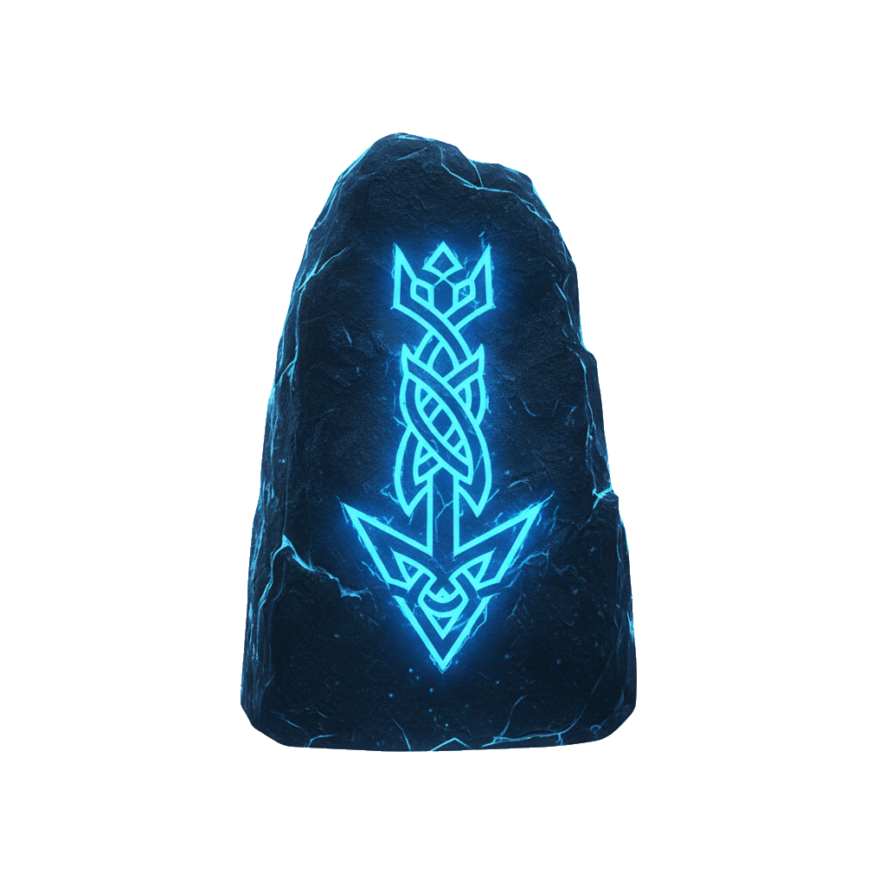

# ⚡ Rune Scroller

<div align="center">
	
</div>

**Lightweight scroll animations. AOS replacement. Works everywhere.**

Built with native IntersectionObserver — zero JS on scroll, GPU-accelerated, 5KB gzipped.

> 🚀 **Open Source** by [ludoloops](https://github.com/ludoloops) at [LeLab.dev](https://lelab.dev)
> 📜 Licensed under **MIT**

<div align="center">
	<a href="https://bundlephobia.com/package/rune-scroller">
		
	</a>
	<a href="https://bundlephobia.com/package/rune-scroller">
		
	</a>
</div>

---

## 🚀 Quick Start

### Any framework — Svelte, React, Vue, Angular, Vanilla JS

```bash
npm install rune-scroller
```

```js
import AOS from "rune-scroller/aos";
AOS.init();
```

```html
<div data-aos="fade-up" data-aos-duration="800">Animated</div>
<div data-aos="zoom-in" data-aos-delay="200">Delayed zoom</div>
```

That's it. Same API as AOS. Works everywhere.

### Svelte (native action)

```svelte
<script>
	import rs from 'rune-scroller';
</script>

<div use:rs={{ animation: 'fade-up' }}>Animates on scroll</div>
```

### React

```jsx
import { useEffect } from "react";
import AOS from "rune-scroller/aos";

function App() {
  useEffect(() => {
    AOS.init();
  }, []);
  return (
    <>
      <h1 data-aos="fade-down">Welcome</h1>
      <p data-aos="fade-up" data-aos-delay="200">
        Subtitle
      </p>
    </>
  );
}
```

### Vue

```vue
<script setup>
import { onMounted } from "vue";
import AOS from "rune-scroller/aos";
onMounted(() => AOS.init());
</script>

<template>
  <div data-aos="fade-up">Animated</div>
</template>
```

### Angular

```typescript
// app.component.ts
import { Component, OnInit } from "@angular/core";
import AOS from "rune-scroller/aos";

@Component({ selector: "app-root", templateUrl: "./app.component.html" })
export class AppComponent implements OnInit {
  ngOnInit() {
    AOS.init();
  }
}
```

```html
<!-- app.component.html -->
<div data-aos="fade-up">Animated</div>
```

### Vanilla JS (no bundler)

```html
<script type="module">
  import AOS from "https://esm.sh/rune-scroller/aos";
  AOS.init();
</script>

<div data-aos="fade-up">Works without any build step</div>
```

---

## ✨ Features

- **Framework agnostic** — Svelte, React, Vue, Angular, Vanilla JS, CDN
- **AOS drop-in** — Same `data-aos` attributes, same `init()` API
- **Zero dependencies** — Pure JS + native IntersectionObserver
- **~5KB gzipped** — Half the size of AOS
- **30 animations** — Fade, Zoom, Flip, Slide, Bounce
- **Zero JS on scroll** — Browser handles detection natively
- **TypeScript support** — Full type definitions
- **SSR-ready** — SvelteKit, Next.js, Nuxt compatible
- **GPU-accelerated** — CSS transforms via `translate3d`
- **Accessible** — Respects `prefers-reduced-motion`
- **No wrapper divs** — Your layouts stay intact

---

### AOS vs rune-scroller

|                           | rune-scroller                                  | AOS                                        |
| ------------------------- | ---------------------------------------------- | ------------------------------------------ |
| **Bundle size (gzipped)** | **~5.1KB** JS+CSS                              | ~11KB JS+CSS                               |
| **Dependencies**          | **0**                                          | lodash.throttle, lodash.debounce           |
| **Scroll detection**      | **IntersectionObserver** (native, C++)         | Scroll event + throttle (JS)               |
| **Per-scroll cost**       | **0** — browser handles it                     | Iterates ALL elements every 99ms           |
| **Layout reads**          | **1 per element** (init only)                  | `offsetParent` loop per element per scroll |
| **Resize handling**       | **ResizeObserver** (native)                    | debounced scroll recalc                    |
| **100 animated elements** | **~0ms per scroll**                            | ~2-5ms per scroll (layout thrashing)       |
| **Animations**            | 30                                             | 28                                         |
| **Framework**             | **Any** (Svelte, React, Vue, Angular, Vanilla) | Vanilla JS only                            |

The key difference: **AOS runs JavaScript on every scroll event** for every element. rune-scroller delegates detection to the browser's native IntersectionObserver — zero JS execution until an element actually enters the viewport.

---

## 🎨 Available Animations (30)

### Fade (10)

- `fade` — Simple opacity fade
- `fade-up` / `fade-down` / `fade-left` / `fade-right` — Fade + translate
- `fade-up-right` / `fade-up-left` / `fade-down-right` / `fade-down-left` — Diagonal fades

### Zoom (10)

- `zoom-in` / `zoom-out` — Scale in/out
- `zoom-in-up` / `zoom-in-down` / `zoom-in-left` / `zoom-in-right` — Zoom + translate
- `zoom-out-up` / `zoom-out-down` / `zoom-out-left` / `zoom-out-right` — Zoom out + translate

### Slide (4)

- `slide-up` / `slide-down` / `slide-left` / `slide-right` — Slide from off-screen

### Flip (4)

- `flip-left` / `flip-right` — 3D flip on Y-axis
- `flip-up` / `flip-down` — 3D flip on X-axis

### Special (2)

- `slide-rotate` — Slide + rotate
- `bounce-in` — Bouncy spring entrance

### Customizable distance

All animations use the `--rs-distance` CSS variable (default: `100px`):

```html
<div data-aos="fade-up" style="--rs-distance: 200px">Farther slide</div>
```

---

## ⚙️ Options

### AOS Mode (data attributes)

| Attribute           | Example         | Description                |
| ------------------- | --------------- | -------------------------- |
| `data-aos`          | `"fade-up"`     | Animation name             |
| `data-aos-duration` | `"800"`         | Duration in ms             |
| `data-aos-delay`    | `"200"`         | Delay in ms                |
| `data-aos-easing`   | `"ease-in-out"` | CSS timing function        |
| `data-aos-offset`   | `"120"`         | Trigger offset in px       |
| `data-aos-once`     | `"true"`        | Animate only once          |
| `data-aos-mirror`   | `"true"`        | Animate on scroll away too |

### AOS init options

```js
AOS.init({
  offset: 120,
  duration: 400,
  delay: 0,
  easing: "ease",
  once: false,
  mirror: false,
  startEvent: "DOMContentLoaded",
});
```

### Svelte Action options

```typescript
interface RuneScrollerOptions {
  animation?: AnimationType; // default: 'fade-up'
  duration?: number; // default: 400
  delay?: number; // default: 0
  easing?: string; // default: 'ease'
  repeat?: boolean; // default: false
  debug?: boolean;
  offset?: number; // negative = earlier trigger
  onVisible?: (el: HTMLElement) => void;
  sentinelColor?: string;
  sentinelId?: string;
}
```

---

## 🎯 How It Works

1. Invisible 1px sentinel appended as child of the animated element
2. When sentinel enters viewport, animation triggers via IntersectionObserver
3. Pure CSS transitions (GPU-accelerated via `translate3d`)
4. ResizeObserver auto-repositions sentinel

**No wrapper divs** — the element itself becomes the positioning context. Your flex/grid layouts stay intact.

---

## ♿ Accessibility

Respects `prefers-reduced-motion` — animations are disabled automatically.

---

## 📚 API Reference

```typescript
// Framework agnostic (AOS mode)
import AOS from "rune-scroller/aos";
AOS.init();
AOS.refresh();
AOS.refreshHard();

// Svelte action (default)
import rs from "rune-scroller";

// Named exports
import {
  runeScroller,
  useIntersection,
  useIntersectionOnce,
  calculateRootMargin,
  ANIMATION_TYPES,
} from "rune-scroller";

// Types
import type { AnimationType, RuneScrollerOptions } from "rune-scroller";
```

---

## 📖 Examples

### Staggered Animations

```svelte
<script>
	import rs from 'rune-scroller';
	const items = ['Item 1', 'Item 2', 'Item 3'];
</script>

{#each items as item, i}
	<div use:rs={{ animation: 'fade-up', duration: 800, delay: i * 100 }}>
		{item}
	</div>
{/each}
```

### Hero Section

```html
<h1 data-aos="fade-down" data-aos-duration="1000">Welcome</h1>
<p data-aos="fade-up" data-aos-duration="1200">Subtitle</p>
<button data-aos="zoom-in" data-aos-duration="800">Get Started</button>
```

---

## 🔄 Replacing AOS

```bash
npm uninstall aos
npm install rune-scroller
```

```diff
- import AOS from 'aos';
- import 'aos/dist/aos.css';
+ import AOS from 'rune-scroller/aos';
```

Everything else stays the same. Same attributes, same options.

---

## 🔗 Links

- **npm**: [rune-scroller](https://www.npmjs.com/package/rune-scroller)
- **GitHub**: [lelabdev/rune-scroller](https://github.com/lelabdev/rune-scroller)
- **Changelog**: [CHANGELOG.md](./CHANGELOG.md)

---

## 📄 License

MIT © [ludoloops](https://github.com/ludoloops)

---

Made with ❤️ by [LeLab.dev](https://lelab.dev)
