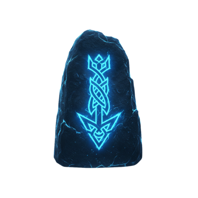

# ⚡ Rune Scroller

<div align="center">
	
</div>

**Lightweight scroll animations. AOS replacement.**

Built with native IntersectionObserver — zero JS on scroll and GPU-accelerated. Requires a browser with [IntersectionObserver support](https://caniuse.com/intersectionobserver).

> 🚀 **Open Source** by [ludoloops](https://github.com/ludoloops) at [LeLab.dev](https://lelab.dev)
> 📜 Licensed under **MIT**

<div align="center">
	<a href="https://bundlephobia.com/package/rune-scroller">
		
	</a>
	<a href="https://bundlephobia.com/package/rune-scroller">
		
	</a>
</div>

---

## 🚀 Quick Start

### Any framework — Svelte, React, Vue, Angular, Vanilla JS

```bash
npm install rune-scroller
```

```js
import "rune-scroller/animations.css";
import AOS from "rune-scroller/aos";
AOS.init();
```

```html
<div data-aos="fade-up" data-aos-duration="800">Animated</div>
<div data-aos="zoom-in" data-aos-delay="200">Delayed zoom</div>
```

That's it. It supports the AOS-compatible surface documented below in browsers that support IntersectionObserver.

### Svelte (native action)

```svelte
<script>
	import 'rune-scroller/animations.css';
	import rs from 'rune-scroller';
</script>

<div use:rs={{ animation: 'fade-up' }}>Animates on scroll</div>
```

### React (not tested — should work)

```jsx
import { useEffect } from "react";
import "rune-scroller/animations.css";
import AOS from "rune-scroller/aos";

function App() {
  useEffect(() => {
    AOS.init();
  }, []);
  return (
    <>
      <h1 data-aos="fade-down">Welcome</h1>
      <p data-aos="fade-up" data-aos-delay="200">
        Subtitle
      </p>
    </>
  );
}
```

### Vue (not tested — should work)

```vue
<script setup>
import { onMounted } from "vue";
import "rune-scroller/animations.css";
import AOS from "rune-scroller/aos";
onMounted(() => AOS.init());
</script>

<template>
  <div data-aos="fade-up">Animated</div>
</template>
```

### Angular (not tested — should work)

```typescript
// app.component.ts
import { Component, OnInit } from "@angular/core";
import "rune-scroller/animations.css";
import AOS from "rune-scroller/aos";

@Component({ selector: "app-root", templateUrl: "./app.component.html" })
export class AppComponent implements OnInit {
  ngOnInit() {
    AOS.init();
  }
}
```

```html
<!-- app.component.html -->
<div data-aos="fade-up">Animated</div>
```

### CDN (not tested — should work)

```html
<script type="module">
  import "https://esm.sh/rune-scroller/animations.css";
  import AOS from "https://esm.sh/rune-scroller/aos";
  AOS.init();
</script>

<div data-aos="fade-up">Works without any build step</div>
```

---

## ✨ Features

- **Framework agnostic** — Svelte, React, Vue, Angular, Vanilla JS, CDN
- **AOS-compatible** — Familiar `data-aos` attributes and `init()` API
- **Zero dependencies** — Pure JS + native IntersectionObserver
- **Bundle size** — Current minified and gzip figures are published by Bundlephobia above
- **29 primary animations + 7 legacy aliases** — Fade, Zoom, Flip, Slide, Bounce
- **Zero JS on scroll** — Browser handles detection natively
- **TypeScript support** — Full type definitions
- **SSR-ready** — SvelteKit, Next.js, Nuxt compatible
- **GPU-accelerated** — CSS transforms via `translate3d`
- **Accessible** — Respects `prefers-reduced-motion`
- **No wrapper divs** — Your layouts stay intact

---

### AOS vs rune-scroller

|                           | rune-scroller                                      | AOS                                        |
| ------------------------- | -------------------------------------------------- | ------------------------------------------ |
| **Bundle size**           | See the Bundlephobia badge above                   | See Bundlephobia                           |
| **Dependencies**          | **0**                                              | lodash.throttle, lodash.debounce           |
| **Scroll detection**      | **IntersectionObserver** (native, C++)             | Scroll event + throttle (JS)               |
| **Per-scroll cost**       | **0** — browser handles it                         | Iterates ALL elements every 99ms           |
| **Layout reads**          | **1 per element** (init only)                      | `offsetParent` loop per element per scroll |
| **Resize handling**       | IntersectionObserver; ResizeObserver in debug mode | debounced scroll recalc                    |
| **100 animated elements** | **~0ms per scroll**                                | ~2-5ms per scroll (layout thrashing)       |
| **Animations**            | 29 primary + 7 legacy aliases                      | 28                                         |
| **Framework**             | **Any** (Svelte, React, Vue, Angular, Vanilla)     | Vanilla JS only                            |

The key difference: **AOS runs JavaScript on every scroll event** for every element. rune-scroller delegates detection to the browser's native IntersectionObserver — zero JS execution until an element actually enters the viewport.

## Measured Performance

The reproducible benchmark compares Rune Scroller and `aos@2.3.4` with 50, 200, and 1,000 elements across desktop and mobile Chromium profiles. At 1,000 elements on the measured machine, Rune Scroller completed the scroll scenario in **662–664 ms** versus **869–886 ms** for AOS, and its median worst frame remained **below 17 ms** versus **40–49 ms** for AOS.

Rune Scroller uses one shared `IntersectionObserver` and no scroll or resize listener in this scenario. AOS uses two scroll/resize listeners. Rune Scroller currently retains more JavaScript heap at 1,000 elements, so the results do not claim a memory advantage.

See the complete raw samples, medians, variance inputs, environment, and methodology in [`benchmarks/results/latest.md`](./benchmarks/results/latest.md). Run `bun run benchmark` on the target machine before using these numbers in public material.

## AOS Compatibility

Rune Scroller implements the common declarative AOS workflow, not every legacy AOS behavior.

| Surface                                             | Behavior                                                                                                                     |
| --------------------------------------------------- | ---------------------------------------------------------------------------------------------------------------------------- |
| `data-aos`, duration, delay, easing, offset         | Supported. Invalid numeric values use the configured defaults.                                                               |
| `data-aos-once`                                     | Supported: the element remains visible after its first entry.                                                                |
| `data-aos-mirror`                                   | Supported: the element animates out on an intersection exit and can animate in again. `mirror` takes precedence over `once`. |
| Anchor placement                                    | Supported through `data-aos-anchor-placement`.                                                                               |
| `data-aos-anchor`                                   | Not supported. Use the native action's `observerTarget` for custom targets.                                                  |
| Runtime insertion/removal                           | Supported automatically through `MutationObserver`.                                                                          |
| Runtime changes to existing `data-aos-*` attributes | Call `AOS.refreshHard()` after changing attributes.                                                                          |
| `AOS.refresh()`                                     | Intentional no-op: `IntersectionObserver` recalculates geometry automatically.                                               |
| `AOS.refreshHard()`                                 | Rebuilds AOS actions for the current `[data-aos]` elements.                                                                  |
| AOS events and `data-aos-id`                        | Not supported.                                                                                                               |

---

## 🎨 Available Animations (29 primary + 7 legacy aliases)

### Fade (10)

- `fade` — Simple opacity fade
- `fade-up` / `fade-down` / `fade-left` / `fade-right` — Fade + translate
- `fade-up-right` / `fade-up-left` / `fade-down-right` / `fade-down-left` — Diagonal fades

### Zoom (10)

- `zoom-in` / `zoom-out` — Scale in/out
- `zoom-in-up` / `zoom-in-down` / `zoom-in-left` / `zoom-in-right` — Zoom + translate
- `zoom-out-up` / `zoom-out-down` / `zoom-out-left` / `zoom-out-right` — Zoom out + translate

### Slide (4)

- `slide-up` / `slide-down` / `slide-left` / `slide-right` — Slide from off-screen

### Flip (4)

- `flip-left` / `flip-right` — 3D flip on Y-axis
- `flip-up` / `flip-down` — 3D flip on X-axis

### Special (2)

- `slide-rotate` — Slide + rotate
- `bounce-in` — Bouncy spring entrance

### Customizable distance

All animations use the `--rs-distance` CSS variable (default: `100px`):

```html
<div data-aos="fade-up" style="--rs-distance: 200px">Farther slide</div>
```

---

## ⚙️ Options

### AOS Mode (data attributes)

| Attribute           | Example         | Description                |
| ------------------- | --------------- | -------------------------- |
| `data-aos`          | `"fade-up"`     | Animation name             |
| `data-aos-duration` | `"800"`         | Duration in ms             |
| `data-aos-delay`    | `"200"`         | Delay in ms                |
| `data-aos-easing`   | `"ease-in-out"` | CSS timing function        |
| `data-aos-offset`   | `"120"`         | Trigger offset in px       |
| `data-aos-once`     | `"true"`        | Animate only once          |
| `data-aos-mirror`   | `"true"`        | Animate on scroll away too |

### AOS init options

```js
AOS.init({
  offset: 120,
  duration: 400,
  delay: 0,
  easing: "ease",
  once: false,
  mirror: false,
  startEvent: "DOMContentLoaded",
});
```

### Svelte Action options

```typescript
interface RuneScrollerOptions {
  animation?: AnimationType; // default: 'fade-in'
  duration?: number; // default: 400
  delay?: number; // default: 0
  easing?: string; // default: 'ease'
  repeat?: boolean; // default: false
  debug?: boolean;
  offset?: number; // positive = earlier trigger
  onVisible?: (el: HTMLElement) => void;
  sentinelColor?: string; // debug indicator color
  sentinelId?: string; // debug indicator identifier
}
```

---

## 🎯 How It Works

1. The animated element is observed directly with `IntersectionObserver`.
2. When it enters the viewport, the `is-visible` class triggers its CSS transition.
3. Positive `offset` values extend the viewport bottom, triggering animations earlier while scrolling down.
4. `debug: true` adds a visual sentinel indicator only; it does not affect observation.

**No wrapper divs** — the original element is observed directly, so flex and grid layouts stay intact.

---

## ♿ Accessibility

Respects `prefers-reduced-motion` — animations are disabled automatically.

---

## 📚 API Reference

```typescript
// Framework agnostic (AOS mode)
import AOS from "rune-scroller/aos";
AOS.init();
AOS.refresh();
AOS.refreshHard();

// Svelte action (default)
import rs from "rune-scroller";

// Named exports
import {
  runeScroller,
  useIntersection,
  useIntersectionOnce,
  calculateRootMargin,
  ANIMATION_TYPES,
} from "rune-scroller";

// Types
import type { AnimationType, RuneScrollerOptions } from "rune-scroller";
```

---

## 🧪 Development

```bash
bun run test
bun run check
bun run lint
bun run build
```

Browser tests require Playwright's Chromium runtime once per machine:

```bash
bunx playwright install chromium
bunx playwright test
```

## 📖 Examples

### Staggered Animations

```svelte
<script>
	import rs from 'rune-scroller';
	const items = ['Item 1', 'Item 2', 'Item 3'];
</script>

{#each items as item, i}
	<div use:rs={{ animation: 'fade-up', duration: 800, delay: i * 100 }}>
		{item}
	</div>
{/each}
```

### Hero Section

```html
<h1 data-aos="fade-down" data-aos-duration="1000">Welcome</h1>
<p data-aos="fade-up" data-aos-duration="1200">Subtitle</p>
<button data-aos="zoom-in" data-aos-duration="800">Get Started</button>
```

---

## 🔄 Replacing AOS

```bash
npm uninstall aos
npm install rune-scroller
```

```diff
- import AOS from 'aos';
- import 'aos/dist/aos.css';
+ import 'rune-scroller/animations.css';
+ import AOS from 'rune-scroller/aos';
```

Everything else stays the same. Same attributes, same options.

---

## 🔗 Links

- **npm**: [rune-scroller](https://www.npmjs.com/package/rune-scroller)
- **GitHub**: [lelabdev/rune-scroller](https://github.com/lelabdev/rune-scroller)
- **Changelog**: [CHANGELOG.md](./CHANGELOG.md)

---

## 📄 License

MIT © [ludoloops](https://github.com/ludoloops)

---

Made with ❤️ by [LeLab.dev](https://lelab.dev)
